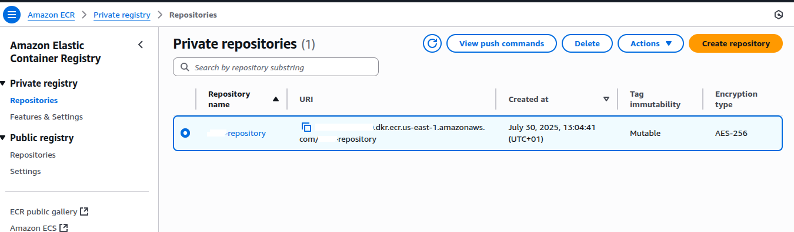
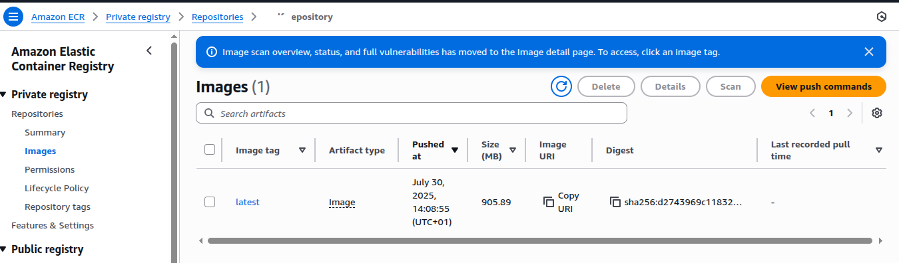

# Amazon ECR Hands-On Lab

This guide walks you through containerizing an application and pushing it to Amazon Elastic Container Registry (ECR).

## Prerequisites

- AWS account with appropriate permissions
- EC2 instance or local machine with internet access
- Basic familiarity with Docker and AWS CLI

## Overview

This hands-on lab covers:
1. Setting up Docker and development tools
2. Building a Docker image
3. Running containers locally
4. Creating and managing ECR repositories
5. Pushing images to ECR
6. Cleaning up resources

## Step-by-Step Instructions

### 1. Environment Setup

First, prepare your scripts and install Docker:

```bash
# Run the Docker installation script
bash docker-install.sh

# Install additional development tools
bash install-dev-tools
```

**Note:** Make sure your `docker-install.sh` script includes Docker installation commands for your operating system.

### 2. Configure AWS CLI

Set up your AWS credentials and default region:

```bash
aws configure
```

You'll be prompted to enter:
- AWS Access Key ID
- AWS Secret Access Key
- Default region name (e.g., `us-east-1`)
- Default output format (e.g., `json`)

### 3. Build Docker Image

Build your application image (ensure you have a Dockerfile in your current directory):

```bash
# Build the Docker image with tag 'hello'
docker build -t hello .

# Verify the image was created
docker images
```

### 4. Test Locally

Run your container locally to verify it works:

```bash
# Run container with port mapping (container port 80 → host port 3000)
docker run -t -i -p 3000:80 hello
```

Access your application at `http://localhost:3000` (or your server's IP:3000)

### 5. ECR Repository Setup

Before pushing to ECR, you need to create a repository. You can do this via AWS Console or CLI:

```bash
# Create ECR repository (optional - can be done via Console)
aws ecr create-repository --repository-name hello-repository --region <region>
```

### 6. Authenticate with ECR

Log in to your ECR registry:

```bash
# Get login token and authenticate Docker with ECR
aws ecr get-login-password --region <region> | docker login --username AWS --password-stdin <aws_account_id>.dkr.ecr.<region>.amazonaws.com
```

**Replace placeholders:**
- `<region>`: Your AWS region (e.g., `us-east-1`)
- `<aws_account_id>`: Your 12-digit AWS account ID

### 7. Tag and Push Image

Prepare and push your image to ECR:

```bash
# Check current images
docker images

# Tag your image for ECR
docker tag hello:latest <aws_account_id>.dkr.ecr.<region>.amazonaws.com/hello-repository

# Verify the new tag was created
docker images

# Push image to ECR
docker push <aws_account_id>.dkr.ecr.<region>.amazonaws.com/hello-repository:latest
```


ECR Private Repository 

Pushed image

### 8. Clean Up Resources

Remove the image and repository when done:

```bash
# Delete the image from ECR repository
aws ecr batch-delete-image --repository-name hello-repository --image-ids imageTag=latest --region <region>

# Delete the entire ECR repository
aws ecr delete-repository --repository-name hello-repository --force --region <region>
```

## Important Notes

### Required Files

Ensure you have these files in your working directory:
- `docker-install.sh` - Docker installation script
- `install-dev-tools` - Development tools installation script
- `Dockerfile` - Instructions for building your application image
- Application source code

### AWS Permissions

Your AWS user/role needs these permissions:
- `ecr:GetAuthorizationToken`
- `ecr:BatchCheckLayerAvailability`
- `ecr:GetDownloadUrlForLayer`
- `ecr:BatchGetImage`
- `ecr:InitiateLayerUpload`
- `ecr:UploadLayerPart`
- `ecr:CompleteLayerUpload`
- `ecr:PutImage`
- `ecr:CreateRepository`
- `ecr:DeleteRepository`
- `ecr:BatchDeleteImage`

### Troubleshooting

**Docker permission denied:**
```bash
sudo usermod -aG docker $USER
# Log out and back in, or run:
newgrp docker
```

**ECR authentication fails:**
- Verify your AWS credentials with `aws sts get-caller-identity`
- Check that your region matches in all commands
- Ensure your account ID is correct

**Image push fails:**
- Verify the repository exists in ECR
- Check that your image tag matches the repository URI exactly

## Cost Considerations

- ECR charges for storage and data transfer
- Delete unused images and repositories to avoid ongoing charges
- Consider using image scanning features for security

## Next Steps

After completing this lab, consider exploring:
- ECR image scanning for vulnerabilities
- ECR lifecycle policies for automatic cleanup
- Integration with ECS, EKS, or Lambda
- Multi-region replication
- Cross-account permissions

## Additional Resources

- [Amazon ECR User Guide](https://docs.aws.amazon.com/ecr/)
- [Docker Documentation](https://docs.docker.com/)
- [AWS CLI Reference](https://docs.aws.amazon.com/cli/)
